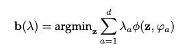
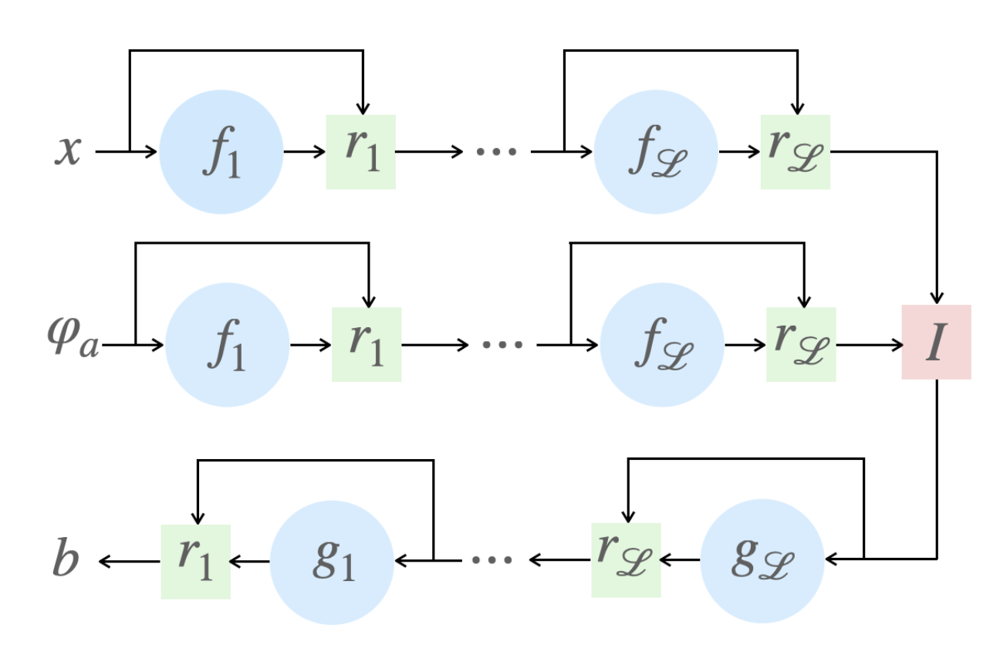
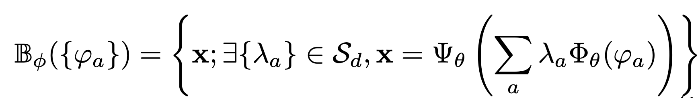
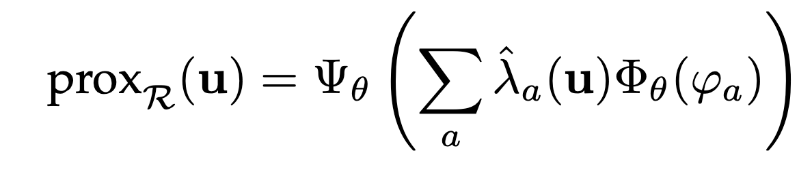
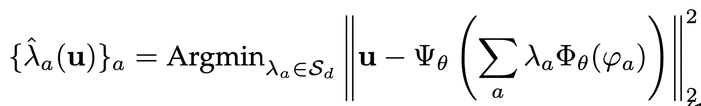
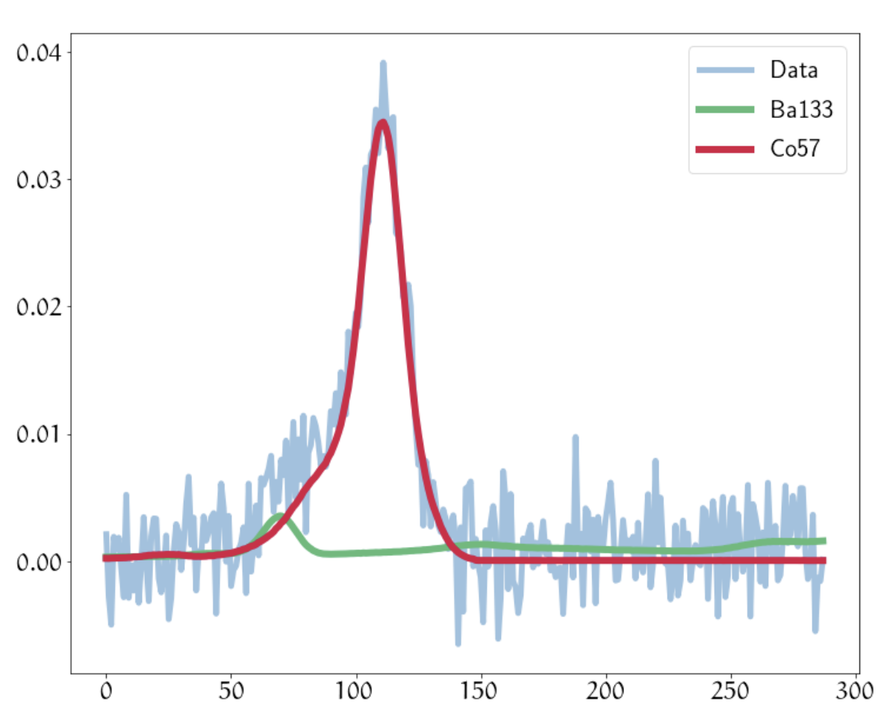

# Interpolator AutoEncoder (IAE)

This is the first version of a learning-based interpolatory scheme. It basically allows to build an non-linear interpolatory process from anchor points.

#### Gist of the method

The basic idea would be to build barycenters from known anchor points $\varphi_a$ (e.g. known examples coming from simulations or measurements) as follows:

In the IAE, this is first performed by learning an interpolatory scheme. The IAE architecture, which is reminiscent of an autoencoder with residual shortcuts, looks like this:

where the f and g functions are standard dense layers equipped with a non-linear activation functions. I is a linear interpolator in the code domain.

One of the applications of the resulting models is to compute the projection onto the "barycentric span":

which one can evaluate by solving:

where the barycentric weights are defined as:

### Application to blind regression in \gamma-ray spectroscopy

A simple, but illustrative application is a blind linear regression problem in spectroscopy where the data are composed of the linear mixture of spectra originating from various radionuclides. Neither the spectral signatures of the radionuclides nor the mixing weights are known. A simple example of such measurements is given below:

In this context, the IAE allows to learn a model for the spectral signatures of each radionuclide. One can then design an unmixing algorithm where the solution is constrained to belong to the barycentric span of each model.
The following figure displays the estimated spectra for a single radionuclide (baryum) with IAE as well as a constraint based on the barycentric span of the anchor points with respect to the Kullback-Leibler divergence.

#### References

-- J. Bobin, F. Acero, A. Picquenot. [Metric learning for semi-supervised sparse source separation with spectral examples](https://hal.archives-ouvertes.fr/hal-02426994). proceedings of CAMSAP 2019, Guadeloupe, France, 2019.

-- J. Bobin, R. Carloni Gertosio, C. Bobin and C. Thiam. [Non-linear interpolation learning for example-based inverse problem regularization](https://hal.archives-ouvertes.fr/hal-02426994). working paper, 2021.
